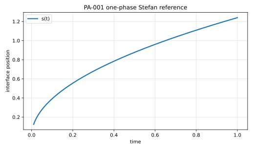

# PA-001 - Planar one-phase Stefan problem

## Purpose

This benchmark verifies the motion of a planar phase-change front driven by
one-sided heat diffusion. It is the minimal verification case for the Stefan
condition, the fixed interfacial temperature, interfacial heat fluxes, interface
position convergence, and global latent-heat balance.

## Physical Configuration

A semi-infinite material initially at the phase-change temperature is heated
from one side. A liquid layer grows from the heated wall and is separated from
the solid by a moving planar interface.

```text
x = 0                        x = s(t)
| heated wall | liquid phase | interface | solid at T_m |
```

The active phase is the liquid phase. The solid phase remains at the
phase-change temperature and does not solve a heat equation.

## Governing Equations

In the liquid phase, $0 < x < s(t)$,

$$
\rho c_p \partial_t T = \partial_x(k \partial_x T).
$$

At the moving interface,

$$
T(s(t),t) = T_m.
$$

The Stefan condition is

$$
\rho L \frac{ds}{dt}
=
-k \partial_x T(s(t)^-,t).
$$

This sign convention assumes that the liquid occupies $0 < x < s(t)$ and that
the interface moves toward positive $x$ during melting.

## Boundary And Initial Conditions

At the heated wall,

$$
T(0,t) = T_h, \qquad T_h > T_m.
$$

At the interface,

$$
T(s(t),t) = T_m.
$$

The similarity solution starts from

$$
s(0)=0.
$$

For numerical computations, initialize at a small nonzero time $t_0$ using the
reference solution to avoid the singular gradient at $t=0$.

## Material Parameters

Use this dimensionless setup for the reference case.

| Parameter | Symbol | Value |
|---|---:|---:|
| density | $\rho$ | 1 |
| heat capacity | $c_p$ | 1 |
| thermal conductivity | $k$ | 1 |
| thermal diffusivity | $\alpha=k/(\rho c_p)$ | 1 |
| melting temperature | $T_m$ | 0 |
| hot-wall temperature | $T_h$ | 1 |
| Stefan number | $\mathrm{Ste}=c_p(T_h-T_m)/L$ | 1 |
| latent heat | $L$ | 1 |

## Reference Solution

The exact similarity solution is

$$
s(t) = 2\lambda\sqrt{\alpha t},
$$

and

$$
T(x,t)
=
T_h
-
(T_h-T_m)
\frac{
\operatorname{erf}\left(x/(2\sqrt{\alpha t})\right)
}{
\operatorname{erf}(\lambda)
}.
$$

The parameter $\lambda$ is determined from

$$
\mathrm{Ste}
=
\sqrt{\pi}\lambda \exp(\lambda^2)\operatorname{erf}(\lambda).
$$

For the recommended case $\mathrm{Ste}=1$,

$$
\lambda = 0.620062633313595,
$$

so

$$
s(t) = 1.24012526662719\sqrt{t}.
$$

The file `data/PA-001/reference.csv` tabulates $s(t)$ and $T(x,t)$ for selected
times and normalized positions $\chi=x/s(t)$.



## Recommended Numerical Setup

Use a finite domain $0 \le x \le 2$ and simulate from $t_0=0.01$ to
$t_\mathrm{end}=1$. Initialize the interface and liquid temperature from the
reference solution at $t_0$. Keep the right boundary in the solid at $T_m$ far
enough from the interface, or impose a phase-aware condition that does not alter
the one-phase solution.

## Quantities To Report

- interface position $s_h(t)$ at every output time,
- absolute interface error $|s_h(t)-s(t)|$,
- temperature profiles at $t=0.1$, $0.4$, and $1.0$,
- global latent plus sensible energy balance,
- observed convergence rate under grid refinement.

## Known Difficulties

- the initial singularity at $t=0$,
- wrong sign in the Stefan condition,
- evaluating the one-sided gradient on the liquid side,
- inconsistent boundary conditions in the solid phase,

## References

@AlexiadesSolomon1993
@Crank1975
