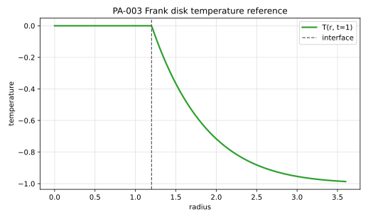

# PA-003 - Frank disk

## Purpose

This benchmark verifies a radially symmetric two-dimensional Stefan problem in
which a circular solid nucleus grows into an undercooled liquid. It is useful
for testing curved-interface motion, radial similarity solutions, area
conservation, isotropy on Cartesian grids, and interface reconstruction.

## Physical Configuration

The solid disk is centered at the origin and the moving interface is

$$
r=R(t).
$$

```text
solid nucleus, T = T_m       liquid, T -> T_inf
r < R(t)                    r > R(t)
```

The analytical reference is radial, but numerical methods should solve the
problem in the full two-dimensional domain unless they are specifically being
tested in radial coordinates.

## Governing Equations

Use the nondimensional heat equation in the thermally active liquid:

$$
\partial_t T = \nabla^2 T,
\qquad r>R(t).
$$

In radial form,

$$
\partial_tT
=
\frac{1}{r}\partial_r(r\partial_rT).
$$

The solid nucleus is held at the phase-change temperature,

$$
T=0,\qquad r\le R(t).
$$

At the moving interface,

$$
T(R(t),t)=0,
$$

and

$$
\frac{dR}{dt}=\mathrm{St}\,\partial_rT(R(t)^+,t).
$$

The recommended benchmark uses the same sign convention as recent Frank-disk
validation tests: $\mathrm{St}<0$ and $T_\infty<0$ produce outward growth.

## Boundary And Initial Conditions

The infinite-domain reference satisfies

$$
T(r,t)\to T_\infty
\qquad\text{as }r\to\infty.
$$

Initialize a finite-domain simulation at $t_0>0$ with

$$
R(t_0)=S_0\sqrt{t_0}.
$$

Use the exact radial temperature outside the disk and $T=0$ inside it.

## Material Parameters

Use this nondimensional reference case.

| Parameter | Symbol | Value |
|---|---:|---:|
| thermal diffusivity | $\alpha$ | 1 |
| phase-change temperature | $T_m$ | 0 |
| Stefan coefficient | $\mathrm{St}$ | -0.4 |
| similarity radius | $S_0$ | 1.2 |
| initial time | $t_0$ | 0.1 |
| final time | $t_\mathrm{end}$ | 1 |
| far-field temperature | $T_\infty$ | -0.999 |

The full-precision value from the formula below is

$$
T_\infty = -0.99905352952645.
$$

## Reference Solution

The interface radius is

$$
R(t)=S_0\sqrt{t}.
$$

Let

$$
s=\frac{r}{\sqrt{t}},
\qquad
F(s)=E_1\left(\frac{s^2}{4}\right),
$$

where

$$
E_1(z)=\int_z^\infty \frac{\exp(-q)}{q}\,dq.
$$

The exact temperature field is

$$
T(r,t)
=
\begin{cases}
0, & s\le S_0,\\
T_\infty\left[1-\dfrac{F(s)}{F(S_0)}\right], & s>S_0.
\end{cases}
$$

The far-field temperature is fixed by the Stefan condition:

$$
T_\infty
=
\frac{S_0F(S_0)}
{-2\mathrm{St}F'(S_0)},
$$

with

$$
F'(s)=-\frac{2}{s}\exp\left(-\frac{s^2}{4}\right).
$$

The file `data/PA-003/reference.csv` tabulates $R(t)$ and $T(r,t)$ for selected
times and normalized radii.



## Recommended Numerical Setup

Use $\Omega=[-2,2]^2$, initialize at $t_0=0.1$, and simulate to
$t_\mathrm{end}=1$. The exact final radius is

$$
R(1)=1.2.
$$

## Quantities To Report

- area-equivalent radius $R_h=\sqrt{A_h/\pi}$,
- radial interface error measured over interface points,
- radial temperature profile sampled along coordinate axes and diagonals,
- radial symmetry error of interface position,
- phase area error,
- global energy balance.

## Known Difficulties

- Inconsistent initialization
- a finite computational box can corrupt the far-field condition.

## References

@Frank1950
@GibouFedkiw2005
@BernauerHerzog2011
@WenigerTorrilhon2025
