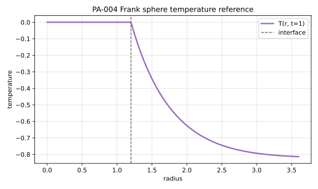

# PA-004 - Frank sphere

## Purpose

This benchmark verifies a radially symmetric three-dimensional Stefan problem in
which a spherical solid nucleus grows into an undercooled liquid. It is the 3D
counterpart of the Frank disk and tests surface heat-flux integration, volume
conservation, radial symmetry, and 3D interface reconstruction.

## Physical Configuration

The solid sphere is centered at the origin and the moving interface is

$$
r=R(t).
$$

```text
solid nucleus, T = T_m       liquid, T -> T_inf
r < R(t)                    r > R(t)
```

The analytical reference is radial, but numerical methods should solve the full
three-dimensional problem unless they are specifically radial solvers.

## Governing Equations

Use the nondimensional heat equation in the thermally active liquid:

$$
\partial_tT=\nabla^2T,
\qquad r>R(t).
$$

In radial form,

$$
\partial_tT
=
\frac{1}{r^2}\partial_r(r^2\partial_rT).
$$

The solid nucleus is held at the phase-change temperature,

$$
T=0,\qquad r\le R(t).
$$

At the moving interface,

$$
T(R(t),t)=0,
$$

and

$$
\frac{dR}{dt}=\mathrm{St}\,\partial_rT(R(t)^+,t).
$$

As in the disk case, $\mathrm{St}<0$ and $T_\infty<0$ produce outward growth.

## Boundary And Initial Conditions

The infinite-domain reference satisfies

$$
T(r,t)\to T_\infty
\qquad\text{as }r\to\infty.
$$

Initialize at $t_0>0$ with

$$
R(t_0)=S_0\sqrt{t_0}.
$$

Use the exact radial temperature outside the sphere and $T=0$ inside it.

## Material Parameters

Use this nondimensional reference case.

| Parameter | Symbol | Value |
|---|---:|---:|
| thermal diffusivity | $\alpha$ | 1 |
| phase-change temperature | $T_m$ | 0 |
| Stefan coefficient | $\mathrm{St}$ | -0.4 |
| similarity radius | $S_0$ | 1.2 |
| initial time | $t_0$ | 0.1 |
| final time | $t_\mathrm{end}$ | 1 |
| far-field temperature | $T_\infty$ | -0.821 |

The full-precision value from the formula below is

$$
T_\infty = -0.821033129452817.
$$

## Reference Solution

The interface radius is

$$
R(t)=S_0\sqrt{t}.
$$

Let

$$
s=\frac{r}{\sqrt{t}},
\qquad
F(s)=\frac{\operatorname{erfc}(s/2)}{s}.
$$

The exact temperature field is

$$
T(r,t)
=
\begin{cases}
0, & s\le S_0,\\
T_\infty\left[1-\dfrac{F(s)}{F(S_0)}\right], & s>S_0.
\end{cases}
$$

The far-field temperature is fixed by the Stefan condition:

$$
T_\infty
=
\frac{S_0F(S_0)}
{-2\mathrm{St}F'(S_0)},
$$

with

$$
F'(s)
=
-\frac{\exp(-s^2/4)}{\sqrt{\pi}s}
-
\frac{\operatorname{erfc}(s/2)}{s^2}.
$$

The file `data/PA-004/reference.csv` tabulates $R(t)$ and $T(r,t)$ for selected
times and normalized radii.



## Recommended Numerical Setup

Use $\Omega=[-2,2]^3$, initialize at $t_0=0.1$, and simulate to
$t_\mathrm{end}=1$. The exact final radius is

$$
R(1)=1.2.
$$

## Quantities To Report

- volume-equivalent radius $R_h=(3V_h/(4\pi))^{1/3}$,
- interface radius error over reconstructed interface points,
- radial temperature profile sampled on axes and diagonals,
- radial symmetry error,
- phase volume error,
- global energy balance.

## Known Difficulties

- Mullins-Sekerka-type instability can be triggered
- Inconsistent initialization
- a finite computational box can corrupt the far-field condition.

## References

@Frank1950
@GibouFedkiw2005
@BernauerHerzog2011
@WenigerTorrilhon2025
