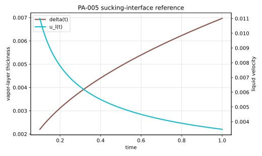

# PA-005 - Sucking interface problem

## Purpose

This benchmark verifies a planar evaporating interface with Stefan flow. It is
more demanding than a pure Stefan diffusion problem because the density jump
creates a velocity field in the liquid, and that flow convects the thermal
boundary layer that drives phase change.

## Physical Configuration

A vapor layer is attached to the left wall of a one-dimensional domain. The
vapor and left wall are at saturation temperature. The liquid on the right is
superheated.

```text
x = 0                    x = delta(t)                     x = L
| saturated wall | vapor | evaporating interface | superheated liquid |
```

The interface moves toward positive $x$ as liquid evaporates. This benchmark is
often implemented in a two-dimensional box with a planar interface, but the
reference solution is one-dimensional.

## Governing Equations

The liquid temperature satisfies

$$
\partial_t T_l + u_l \partial_x T_l
=
\alpha_l \partial_{xx}T_l,
\qquad x>\delta(t),
$$

where

$$
\alpha_i = \frac{k_i}{\rho_i c_{p,i}}.
$$

The interface temperature is fixed:

$$
T_l(\delta(t),t)=T_{sat}.
$$

The mass flux produces different phase and interface velocities. For a planar
interface,

$$
\dot m = \rho_g\frac{d\delta}{dt},
$$

and the liquid velocity induced by expansion is

$$
u_l(t)=\left(1-\frac{\rho_g}{\rho_l}\right)\frac{d\delta}{dt}.
$$

The interfacial energy balance is embedded in the similarity equation for the
growth constant $\beta$ given below.

## Boundary And Initial Conditions

Use the infinite-domain analytical solution as the reference:

$$
T_l(x,t)\to T_{bulk}
\qquad \text{as } x\to\infty.
$$

At the left wall and in the vapor layer,

$$
T_g=T_{sat}.
$$

For a finite-domain simulation, initialize at $t_0>0$ from the exact solution:

$$
\delta(t_0)=2\beta\sqrt{\alpha_g t_0}.
$$

## Material Parameters

Use the water/vapor setup used in Basilisk's sucking-interface example.

| Parameter | Symbol | Value | Unit |
|---|---:|---:|---|
| liquid density | $\rho_l$ | 958.4 | kg/m^3 |
| vapor density | $\rho_g$ | 0.597 | kg/m^3 |
| liquid conductivity | $k_l$ | 0.679 | W/(m K) |
| vapor conductivity | $k_g$ | 0.025 | W/(m K) |
| liquid heat capacity | $c_{p,l}$ | 4216 | J/(kg K) |
| vapor heat capacity | $c_{p,g}$ | 2030 | J/(kg K) |
| latent heat | $h_{lg}$ | $2.26\times10^6$ | J/kg |
| saturation temperature | $T_{sat}$ | 373.15 | K |
| bulk liquid temperature | $T_{bulk}$ | 378.15 | K |

The corresponding thermal diffusivities are

$$
\alpha_l = 1.68043750970150\times10^{-7}\ \mathrm{m^2/s},
\qquad
\alpha_g = 2.06285945325973\times10^{-5}\ \mathrm{m^2/s}.
$$

## Reference Solution

The vapor-layer thickness is

$$
\delta(t)=2\beta\sqrt{\alpha_g t}.
$$

The growth constant $\beta$ solves

$$
\beta
-
\frac{
(T_{bulk}-T_{sat})c_{p,g}k_l\sqrt{\alpha_g}
\exp\left(
-\beta^2\frac{\rho_g^2\alpha_g}{\rho_l^2\alpha_l}
\right)
}{
h_{lg}k_g\sqrt{\pi\alpha_l}
\operatorname{erfc}
\left(
\beta\frac{\rho_g\sqrt{\alpha_g}}{\rho_l\sqrt{\alpha_l}}
\right)
}
=0.
$$

For the recommended case,

$$
\beta = 0.767053984351931.
$$

The liquid temperature is

$$
T_l(x,t)
=
T_{bulk}
-
\frac{T_{bulk}-T_{sat}}
{
\operatorname{erfc}
\left(
\beta\frac{\rho_g\sqrt{\alpha_g}}{\rho_l\sqrt{\alpha_l}}
\right)
}
\operatorname{erfc}
\left(
\frac{x}{2\sqrt{\alpha_l t}}
+
\beta\frac{\rho_g-\rho_l}{\rho_l}
\sqrt{\frac{\alpha_g}{\alpha_l}}
\right).
$$

The liquid velocity reference is

$$
u_l(t)
=
\left(1-\frac{\rho_g}{\rho_l}\right)
\beta\sqrt{\frac{\alpha_g}{t}}.
$$

The file `data/PA-005/reference.csv` tabulates $\delta(t)$, $u_l(t)$, and
$T_l(x,t)$ for selected times and positions.



## Reference Assets

The reference CSV file and SVG figure are generated from:

```bash
python3 scripts/plot_reference_figures.py PA-005
```

The CSV table intentionally uses a compact set of verification points. The SVG
figure uses 401 plotted points for smooth interface-position and velocity
curves.

## Recommended Numerical Setup

Use $0\le x\le 0.02\ \mathrm{m}$, initialize at $t_0=0.1\ \mathrm{s}$, and
simulate to $t_\mathrm{end}=1\ \mathrm{s}$. Set the left boundary temperature
to $T_{sat}$ and the right boundary temperature to $T_{bulk}$.

## Quantities To Report

- interface position $\delta_h(t)$,
- liquid velocity $u_l(t)$ away from the interface,
- vapor volume or layer thickness,
- liquid temperature profile at $t=0.1$, $0.4$, and $1.0$,
- Stefan-flow divergence or equivalent mass-source balance,
- global energy balance.

## Known Difficulties

- the finite-domain boundary must remain far enough from the thermal layer,
- the initial time shift must match the initialized vapor-layer thickness,
- the far-field liquid temperature must stay at the prescribed superheat,
- the vapor layer can become too thin if the benchmark is initialized too early,
- post-processing should measure the planar layer thickness, not a local noisy
  interface marker.

## References

@WelchWilson2000
@Rajkotwala2019
@ZhaoZhangNi2022
@BoydLing2023
@BasiliskSuckingProblem
