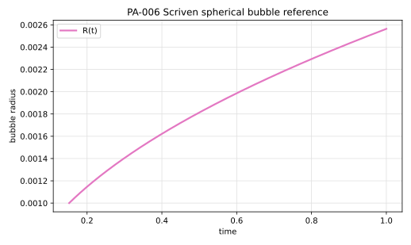

# PA-006 - Scriven spherical vapor bubble growth

## Purpose

This benchmark verifies heat-transfer-controlled growth of a spherical vapor
bubble in an infinite superheated liquid. It tests radial Stefan flow,
curvature-free spherical similarity growth, interfacial heat transfer, and
large density-ratio phase expansion.

## Is There A 2D Scriven Case?

Scriven's original analytical solution is spherically symmetric. The usual
"2D" numerical implementation is an axisymmetric $(r,z)$ computation, which
represents a three-dimensional sphere. A true two-dimensional cylindrical
analogue can be formulated, but it is not the standard Scriven spherical bubble
benchmark and uses a different radial geometry.

## Physical Configuration

A vapor bubble is embedded in an initially quiescent, uniformly superheated
liquid. The interface is spherical:

$$
r=R(t).
$$

```text
vapor bubble, T = T_sat       superheated liquid, T -> T_bulk
r < R(t)                     r > R(t)
```

The gas is at saturation temperature. Heat conducted from the liquid supplies
latent heat at the interface and drives bubble growth.

## Governing Equations

The liquid temperature satisfies the radial advection-diffusion equation

$$
\partial_tT_l + u_r\partial_rT_l
=
\alpha_l
\frac{1}{r^2}
\partial_r
\left(
r^2\partial_rT_l
\right),
\qquad r>R(t).
$$

The liquid radial velocity comes from phase expansion and is included in the
Scriven similarity solution. At the interface,

$$
T_l(R(t),t)=T_{sat}.
$$

The heat flux at the interface balances latent and sensible energy needed to
create vapor. The resulting similarity equation for the growth constant is
given below.

## Boundary And Initial Conditions

In the infinite-domain reference solution,

$$
T_l(r,t)\to T_{bulk}
\qquad \text{as } r\to\infty.
$$

For a finite-domain simulation, initialize at $t_0>0$ using

$$
R(t_0)=2\beta\sqrt{\alpha_l t_0}
$$

and set the liquid temperature from the analytical radial profile.

## Material Parameters

Use the water/vapor setup with Jakob number $\mathrm{Ja}=3$ used in Basilisk's
Scriven example.

| Parameter | Symbol | Value | Unit |
|---|---:|---:|---|
| liquid density | $\rho_l$ | 958 | kg/m^3 |
| vapor density | $\rho_g$ | 0.59 | kg/m^3 |
| liquid conductivity | $k_l$ | 0.6 | W/(m K) |
| vapor conductivity | $k_g$ | 0.026 | W/(m K) |
| liquid heat capacity | $c_{p,l}$ | 4216 | J/(kg K) |
| vapor heat capacity | $c_{p,g}$ | 2034 | J/(kg K) |
| latent heat | $h_{lg}$ | $2.257\times10^6$ | J/kg |
| saturation temperature | $T_{sat}$ | 373 | K |
| Jakob number | $\mathrm{Ja}$ | 3 | - |
| bulk liquid temperature | $T_{bulk}$ | 373.989096611774 | K |

The liquid thermal diffusivity is

$$
\alpha_l = 1.48554269845860\times10^{-7}\ \mathrm{m^2/s}.
$$

## Reference Solution

The bubble radius is

$$
R(t)=2\beta\sqrt{\alpha_l t}.
$$

The growth constant $\beta$ solves

$$
\frac{
\rho_l c_{p,l}(T_{bulk}-T_{sat})
}{
\rho_g
\left[
h_{lg}+(c_{p,l}-c_{p,g})(T_{bulk}-T_{sat})
\right]
}
=
2\beta^2
\int_0^1
\exp
\left[
-\beta^2
\left(
(1-x)^{-2}
-2\left(1-\frac{\rho_g}{\rho_l}\right)x
-1
\right)
\right]\,dx.
$$

For the recommended case,

$$
\beta = 3.32643989498138.
$$

The radial liquid temperature profile is

$$
T_l(r,t)
=
T_{bulk}
-
2\beta^2
\frac{
\rho_g
\left[
h_{lg}+(c_{p,l}-c_{p,g})(T_{bulk}-T_{sat})
\right]
}{
\rho_l c_{p,l}
}
\int_{1-R(t)/r}^{1}
\exp
\left[
-\beta^2
\left(
(1-x)^{-2}
-2\left(1-\frac{\rho_g}{\rho_l}\right)x
-1
\right)
\right]\,dx.
$$

Inside the bubble, use $T_g=T_{sat}$.

The file `data/PA-006/reference.csv` tabulates $R(t)$ and $T_l(r,t)$ for
selected times and radii.



## Reference Assets

The reference CSV file and SVG figure are generated from:

```bash
python3 scripts/plot_reference_figures.py PA-006
```

The CSV table intentionally uses a compact set of verification points. The SVG
figure uses 401 plotted points for a smooth curve.

## Recommended Numerical Setup

Use a spherical or axisymmetric domain large enough that the far boundary does
not affect the thermal layer. A practical setup is an axisymmetric domain with
radius and height at least $12\ \mathrm{mm}$, initialized with
$R_0=1\ \mathrm{mm}$ and simulated until $R=2\ \mathrm{mm}$. This corresponds
to the time shift

$$
t_0 = 0.152088195917732\ \mathrm{s}.
$$

For full 3D solvers, use the same radial initial condition in a cubic domain
whose side length is several times the final bubble diameter.

Recommended grid/time refinements:

| Case | Radius cells across $R_0$ | Time step | Final radius |
|---|---:|---:|---:|
| coarse | 16 | adaptive | 2 mm |
| medium | 32 | adaptive | 2 mm |
| fine | 64 | adaptive | 2 mm |

## Quantities To Report

- bubble radius $R_h(t)$ from vapor volume,
- radial temperature profile at selected times,
- radial symmetry error,
- vapor volume conservation relative to $4\pi R^3/3$,
- interfacial heat flux and latent-heat balance,
- convergence of final-radius error.

## Known Difficulties

- this is a 3D spherical benchmark even when solved in 2D axisymmetry,
- the density ratio creates strong radial Stefan flow,
- the temperature profile depends on an integral with a singular endpoint,
- the gas volume source must be consistent with interface advection,
- finite boundaries can distort the infinite-domain similarity solution.

## References

@Scriven1959
@Tanguy2014
@Rajkotwala2019
@BasiliskScrivenProblem
@BasiliskGennariScriven
