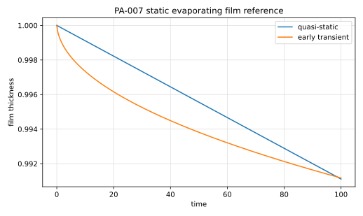

# PA-007 - Static evaporating film

## Purpose

This benchmark verifies diffusion-driven recession of a flat liquid film into a
quiescent vapor domain. It is based on the Basilisk elementary-body static-film
test.

## Physical Configuration

A liquid film initially occupies $0\le y\le h_0$. Vapor fills the region
$h(t)<y<L$. The concentration is fixed at the interface and at the top boundary.

```text
y = 0                 y = h(t)                     y = L
wall | liquid film | evaporating interface | vapor | c = c_inf
```

## Governing Equations

In the vapor phase,

$$
\partial_t c = D\partial_{yy}c.
$$

The quasi-static concentration profile is

$$
c(y,t)
=
c_s-\frac{c_s-c_\infty}{L-h(t)}(y-h(t)).
$$

The film recession speed is approximated by

$$
\frac{dh}{dt}
\approx
-\mu\frac{D}{L},
\qquad
\mu=\frac{c_s-c_\infty}{\rho}.
$$

## Material Parameters

Use the nondimensional Basilisk setup.

| Parameter | Symbol | Value |
|---|---:|---:|
| domain height | $L$ | 10 |
| initial film thickness | $h_0$ | 1 |
| diffusivity | $D$ | 1 |
| interfacial concentration | $c_s$ | 1 |
| far concentration | $c_\infty$ | 0.2 |
| concentration-density ratio | $\mu$ | $8.0\times10^{-4}$ |

## Reference Solution

The open-box quasi-static model is

$$
h_{qs}(t)=h_0-\mu\frac{D}{L-h_0}t.
$$

The early transient half-space approximation is

$$
h_\infty(t)
\approx
h_0
+2\mu\left[
\sqrt{\frac{t_s}{\pi}}
-
\sqrt{\frac{t+t_s}{\pi}}
\right],
$$

with $t_s=0.05$ matching the time offset used in the Basilisk test.

The file `data/PA-007/reference.csv` tabulates the film thickness and recession
speed predicted by these formulas.



## Reference Assets

Generate the CSV and figure with:

```bash
python3 scripts/plot_reference_figures.py PA-007
```

## Recommended Numerical Setup

Use a vertical domain with no-flux side and bottom boundaries, and a fixed top
concentration $c_\infty$. Start from a sharp flat film with $h_0=1$.

## Quantities To Report

- mean film thickness $h(t)$,
- interface recession velocity,
- vapor concentration profile,
- time at which the concentration profile becomes close to linear.

## Known Difficulties

- the initial diffusion layer is singular without a time offset,
- the quasi-static model is valid only after the diffusion transient,
- the top boundary must remain consistent with the open-box approximation,
- post-processing should use mean film thickness rather than local interface
  roughness.

## References

@BasiliskQMagdelaineStaticFilm
