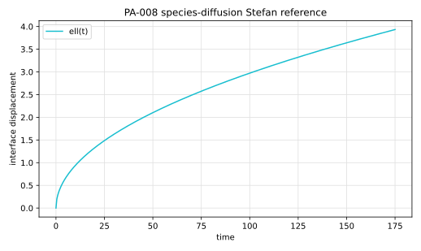

# PA-008 - Species-diffusion Stefan problem

## Purpose

This benchmark verifies a planar interface displaced by diffusion of a soluble
species into the liquid. It is the species-transfer counterpart of a thermal
Stefan problem.

## Physical Configuration

A planar gas-liquid interface releases gas into an initially gas-free liquid.
The concentration at the interface is fixed by Henry's law.

## Governing Equations

The liquid concentration satisfies

$$
\partial_t c = D\partial_{yy}c.
$$

The interface displacement is

$$
\ell(t)=\frac{2}{He}\sqrt{\frac{Dt}{\pi}}.
$$

The concentration field is

$$
c(y,t)
=
c_\Sigma
\left[
1-\operatorname{erf}
\left(
\frac{y-y_\Sigma(t)}{2\sqrt{Dt}}
\right)
\right].
$$

## Material Parameters

Use the Gennari Basilisk setup.

| Parameter | Symbol | Value |
|---|---:|---:|
| Schmidt number | $Sc$ | 10 |
| diffusivity | $D$ | 0.1 |
| Henry coefficient | $He$ | 1.2 |
| interface concentration scale | $c_\Sigma$ | 1 |
| final time | $t_{end}$ | 175 |

## Reference Solution

For the recommended case,

$$
\ell(t)=\frac{2}{1.2}\sqrt{\frac{0.1t}{\pi}}.
$$

The file `data/PA-008/reference.csv` tabulates the displacement and
concentration profile.



## Reference Assets

Generate the CSV and figure with:

```bash
python3 scripts/plot_reference_figures.py PA-008
```

## Recommended Numerical Setup

Use a one-dimensional or planar two-dimensional domain with the far liquid
boundary fixed at zero concentration. Initialize the interface as a flat plane.

## Quantities To Report

- interface displacement $\ell_h(t)$,
- gas volume change,
- concentration profile,
- final displacement error.

## Known Difficulties

- handling the initially singular concentration gradient,
- measuring displacement relative to the initialized interface location,
- keeping the far-field concentration at zero,
- separating species-volume change from numerical interface diffusion.

## References

@Gennari2022
@BasiliskGennariSpeciesStefan
