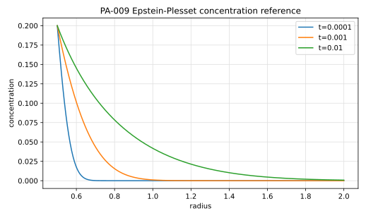

# PA-009 - Epstein-Plesset steady-radius dissolution

## Purpose

This benchmark verifies spherical diffusion from a gas bubble into an
undersaturated liquid while holding the interface shape fixed. It tests the
species field and diffusive mass flux independently of interface advection.

## Physical Configuration

A spherical bubble of radius $R$ is held fixed in a liquid with zero initial and
far-field dissolved gas concentration. The interfacial concentration is fixed by
Henry's law.

## Governing Equations

For $r>R$,

$$
\partial_t c
=
\frac{1}{r^2}
\partial_r
\left(
r^2D\partial_r c
\right).
$$

The conditions are

$$
c(r,0)=c_{bulk},
\qquad
c(R,t)=c_\Sigma,
\qquad
c(r,t)\to c_{bulk}\quad r\to\infty.
$$

## Material Parameters

Use the Gennari Basilisk setup.

| Parameter | Symbol | Value |
|---|---:|---:|
| bubble radius | $R$ | 0.5 |
| Schmidt number | $Sc$ | 0.0526 |
| diffusivity | $D$ | 19.0114068441065 |
| Henry coefficient | $He$ | 5 |
| interfacial concentration | $c_\Sigma$ | 0.2 |
| bulk concentration | $c_{bulk}$ | 0 |
| final time | $t_{end}$ | 0.01 |

## Reference Solution

The concentration field is

$$
c(r,t)
=
c_{bulk}
+
(c_\Sigma-c_{bulk})
\frac{R}{r}
\operatorname{erfc}
\left(
\frac{r-R}{2\sqrt{Dt}}
\right).
$$

The Epstein-Plesset mass-flux relation for the corresponding moving-radius
problem is

$$
\frac{dR}{dt}
=
\frac{DM(c_{bulk}-c_\Sigma)}{\rho_d}
\left[
\frac{1}{R}
+
\frac{1}{\sqrt{\pi Dt}}
\right].
$$

The file `data/PA-009/reference.csv` tabulates the fixed-radius concentration
profile.



## Reference Assets

Generate the CSV and figure with:

```bash
python3 scripts/plot_reference_figures.py PA-009
```

## Recommended Numerical Setup

Use a spherical or axisymmetric domain with far-field concentration fixed at
$c_{bulk}=0$. Keep the bubble radius fixed at $R=0.5$.

## Quantities To Report

- radial concentration profile,
- concentration at sample radii,
- diffusive mass flux at the interface,
- integrated gas released into the liquid.

## Known Difficulties

- resolving the early-time $1/\sqrt{t}$ flux singularity,
- keeping the interface radius fixed while mass is released,
- placing the far boundary sufficiently far from the diffusion layer,
- comparing axisymmetric samples to the spherical radial reference.

## References

@EpsteinPlesset1950
@Crank1975
@Gennari2022
@BasiliskGennariEpsteinPlesset
