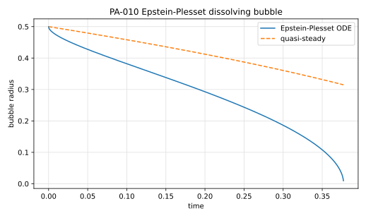

# PA-010 - Epstein-Plesset dissolving bubble

## Purpose

This benchmark verifies the coupled species-diffusion / moving-interface
problem for a spherical bubble dissolving in an undersaturated liquid. It is
the moving-radius companion of PA-009, which freezes the interface and tests
only the concentration field. Here the diffusive mass flux must feed back into
the interface velocity, so the case exercises the full solutal Stefan coupling
in spherical geometry, including the early-time transient flux.

## Physical Configuration

A gas bubble of initial radius $R_0$ is immersed in an infinite quiescent
liquid with uniform initial dissolved-gas concentration $c_\infty$ below the
saturation concentration $c_\Sigma$ imposed at the interface by Henry's law.
The bubble shrinks as gas diffuses into the liquid. Gas-side dynamics,
surface tension, and liquid convection (including the small radial Stefan
flow) are neglected, consistent with the Epstein-Plesset model in the dilute
limit $c_\Sigma/\rho_b \ll 1$.

## Governing Equations

In the liquid, $r > R(t)$,

$$
\partial_t c
=
\frac{D}{r^2}\,
\partial_r\!\left(r^2 \partial_r c\right),
$$

with

$$
c(r,0)=c_\infty,
\qquad
c(R(t),t)=c_\Sigma,
\qquad
c(r,t)\to c_\infty \quad (r\to\infty).
$$

The interface recedes according to the solutal Stefan condition

$$
\rho_b\,\frac{dR}{dt}
=
D\,\partial_r c\big|_{r=R^+},
$$

with $\rho_b$ the gas density inside the bubble (taken constant).

## Reference Solution

Epstein and Plesset obtained, in the quasi-frozen-boundary approximation,

$$
\frac{dR}{dt}
=
-\,\frac{D\,(c_\Sigma-c_\infty)}{\rho_b}
\left[
\frac{1}{R}
+
\frac{1}{\sqrt{\pi D t}}
\right],
$$

an ordinary differential equation that is integrated numerically to machine
precision. Neglecting the transient term $1/\sqrt{\pi D t}$ yields the
closed-form quasi-steady radius

$$
R_{qs}(t)
=
\sqrt{R_0^2 - 2\,\frac{D(c_\Sigma-c_\infty)}{\rho_b}\,t},
$$

which bounds the true radius from above and gives the quasi-steady
dissolution time $t_{qs} = \rho_b R_0^2 / \left(2D(c_\Sigma-c_\infty)\right)$.

## Material Parameters

The parameters extend the PA-009 fixed-radius setup to a moving interface.

| Parameter | Symbol | Value |
|---|---:|---:|
| initial radius | $R_0$ | 0.5 |
| diffusivity | $D$ | 1 |
| interfacial concentration | $c_\Sigma$ | 0.2 |
| bulk concentration | $c_\infty$ | 0 |
| bubble gas density | $\rho_b$ | 1 |
| uptake parameter | $\beta = (c_\Sigma-c_\infty)/\rho_b$ | 0.2 |
| quasi-steady dissolution time | $t_{qs}$ | 0.625 |

## Reference Data

The file `data/PA-010/reference.csv` tabulates $R(t)$ from a high-order
integration of the Epstein-Plesset ODE together with the quasi-steady
closed form $R_{qs}(t)$. The ODE is started at $t_0 = 10^{-8}$ from
$R(t_0)=R_0$; the integrable $1/\sqrt{t}$ singularity of the transient term
is handled with the substitution $t = \tau^2$.



## Reference Assets

Generate the CSV and figure with:

```bash
python3 scripts/plot_reference_figures.py PA-010
```

## Recommended Numerical Setup

Use a spherically symmetric or axisymmetric domain of outer radius at least
$10 R_0$ with $c=c_\infty$ imposed in the far field. Initialize the
concentration uniformly at $c_\infty$; the reference already accounts for the
resulting early-time flux transient. Run until the bubble radius falls below
$0.1 R_0$ or full dissolution.

## Quantities To Report

- bubble radius $R(t)$ and error against the ODE reference,
- dissolution time (or time to reach $R = 0.2 R_0$),
- radial concentration profiles at selected times,
- integrated gas mass released versus bubble mass lost.

## Known Difficulties

- resolving the early-time $1/\sqrt{t}$ interfacial flux,
- interface velocity noise as the bubble becomes small relative to the grid,
- mass conservation between the shrinking bubble and the dissolved field,
- far-field confinement raising the dissolution rate.

## References

@EpsteinPlesset1950
@Gennari2022
@BasiliskGennariEpsteinPlesset
