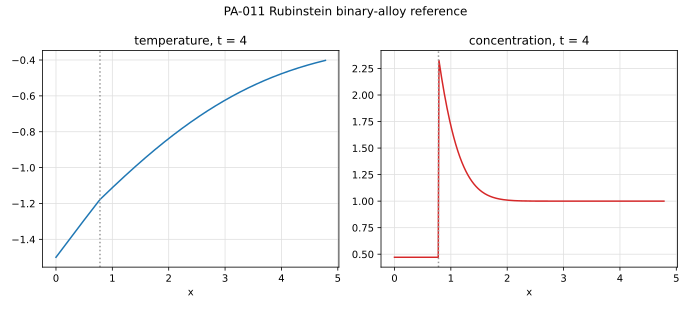

# PA-011 - Binary-alloy solidification (Rubinstein problem)

## Purpose

This benchmark verifies coupled thermo-solutal phase change: heat diffusion in
both phases, solute diffusion in the liquid, solute rejection at the front,
and an interface temperature set by the liquidus rather than by a fixed
melting point. It is the only classical exact solution in which the interface
temperature is itself an unknown coupled to the concentration field, so it
directly tests solvers in which thermal and species Stefan conditions must be
satisfied simultaneously at the same front.

## Physical Configuration

A semi-infinite binary melt occupies $x > 0$ with uniform initial temperature
$T_\infty$ and solute concentration $C_\infty$. At $t=0$ the wall $x=0$ is
brought to $T_0$ below the solidus, and a planar solid layer
$0 < x < s(t)$ grows into the melt. Solute diffuses only in the liquid
($D_s = 0$) and is rejected at the front with equilibrium partition
coefficient $k_p$, so that $C_s^\Gamma = k_p\,C_l^\Gamma$. The interface
temperature follows the linear liquidus

$$
T_\Gamma = T_m + m\,C_l^\Gamma ,
\qquad m < 0 .
$$

## Governing Equations

Heat diffusion in each phase,

$$
\partial_t T_s = \alpha_s\,\partial_{xx} T_s \quad (0<x<s),
\qquad
\partial_t T_l = \alpha_l\,\partial_{xx} T_l \quad (x>s),
$$

solute diffusion in the liquid,

$$
\partial_t C = D\,\partial_{xx} C \quad (x>s),
$$

with the interface conditions at $x = s(t)$:

$$
T_s = T_l = T_m + m\,C^\Gamma,
\qquad
\rho L\,\dot s = k_s\,\partial_x T_s - k_l\,\partial_x T_l,
\qquad
(1-k_p)\,C^\Gamma\,\dot s = -\,D\,\partial_x C .
$$

## Reference Solution

With $s(t) = 2\lambda\sqrt{D t}$ and $\varepsilon_s = \sqrt{D/\alpha_s}$,
$\varepsilon_l = \sqrt{D/\alpha_l}$, the fields are

$$
T_s(x,t) = T_0 + (T_\Gamma - T_0)\,
\frac{\operatorname{erf}\!\big(x/(2\sqrt{\alpha_s t})\big)}
     {\operatorname{erf}(\lambda\varepsilon_s)},
\qquad
T_l(x,t) = T_\infty + (T_\Gamma - T_\infty)\,
\frac{\operatorname{erfc}\!\big(x/(2\sqrt{\alpha_l t})\big)}
     {\operatorname{erfc}(\lambda\varepsilon_l)},
$$

$$
C(x,t) = C_\infty + (C^\Gamma - C_\infty)\,
\frac{\operatorname{erfc}\!\big(x/(2\sqrt{D t})\big)}
     {\operatorname{erfc}(\lambda)} .
$$

The solute balance gives the interface concentration in closed form,

$$
C^\Gamma(\lambda)
=
\frac{C_\infty}
{1 - (1-k_p)\,F(\lambda)},
\qquad
F(\lambda) = \sqrt{\pi}\,\lambda\,e^{\lambda^2}\operatorname{erfc}(\lambda),
$$

and the Stefan condition closes the problem with one transcendental equation
for $\lambda$:

$$
\rho L\,\lambda\sqrt{D}
=
\frac{k_s\,\big(T_\Gamma(\lambda) - T_0\big)\,
      e^{-\lambda^2\varepsilon_s^2}}
     {\sqrt{\pi\alpha_s}\,\operatorname{erf}(\lambda\varepsilon_s)}
-
\frac{k_l\,\big(T_\infty - T_\Gamma(\lambda)\big)\,
      e^{-\lambda^2\varepsilon_l^2}}
     {\sqrt{\pi\alpha_l}\,\operatorname{erfc}(\lambda\varepsilon_l)},
\qquad
T_\Gamma(\lambda) = T_m + m\,C^\Gamma(\lambda).
$$

## Material Parameters

All quantities are non-dimensional. Equal thermal properties are used in both
phases; the Lewis number $\mathrm{Le} = \alpha/D = 20$ produces a solutal
boundary layer much thinner than the thermal one, which is the physically
relevant and numerically demanding regime.

| Parameter | Symbol | Value |
|---|---:|---:|
| density | $\rho$ | 1 |
| heat capacity | $c_p$ | 1 |
| conductivities | $k_s = k_l$ | 1 |
| thermal diffusivities | $\alpha_s = \alpha_l$ | 1 |
| solute diffusivity (liquid) | $D$ | 0.05 |
| latent heat | $L$ | 1 |
| pure-solvent melting point | $T_m$ | 0 |
| liquidus slope | $m$ | -0.5 |
| partition coefficient | $k_p$ | 0.2 |
| initial concentration | $C_\infty$ | 1 |
| initial melt temperature | $T_\infty$ | -0.3 |
| wall temperature | $T_0$ | -1.5 |

The initial melt is above its liquidus $T_m + mC_\infty = -0.5$ and the wall
is well below it, so a solid layer nucleates at the wall and grows.

## Reference Data

The file `data/PA-011/reference.csv` tabulates $\lambda$, $C^\Gamma$,
$T_\Gamma$, the front position $s(t)$, and temperature and concentration
profiles at selected times, computed from the transcendental system with
`mpmath` root finding.



## Reference Assets

Generate the CSV and figure with:

```bash
python3 scripts/plot_reference_figures.py PA-011
```

## Recommended Numerical Setup

Use a 1D domain large enough that the thermal far field is unperturbed at the
final time ($x \in [0, 20]$ up to $t = 10$ is sufficient). Impose $T = T_0$ at
the wall, $T = T_\infty$ and $C = C_\infty$ at the far boundary, and zero
solute flux into the solid. Initialize with a small solid seed layer and the
similarity fields at a small positive time $t_0$ to avoid the nucleation
singularity.

## Quantities To Report

- front position $s(t)$ and error against $2\lambda\sqrt{Dt}$,
- interface temperature and concentration histories against
  $T_\Gamma$, $C^\Gamma$,
- temperature and concentration profiles at selected times,
- global solute conservation (rejected solute vs. liquid enrichment).

## Known Difficulties

- the interface temperature is an unknown: enforcing $T_\Gamma = T_m + mC^\Gamma$
  requires simultaneous (or tightly iterated) thermal-solutal coupling,
- the solutal layer thickness scales as $\sqrt{D/\alpha}$ relative to the
  thermal layer: under-resolving it biases $C^\Gamma$ and thus the front speed,
- spurious solute leakage into the solid destroys the similarity solution,
- constitutional supercooling exists ahead of the front; numerical
  perturbations can trigger unphysical instability of the planar solution.

## References

@Rubinstein1971
@AlexiadesSolomon1993
