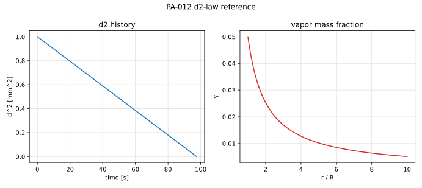

# PA-012 - d2-law evaporating droplet

## Purpose

This benchmark verifies isothermal, mass-transfer-driven evaporation of a
spherical droplet with Stefan flow in the gas. Unlike PA-008 and PA-010, the
gas-phase transport is convective-diffusive: the radial blowing velocity
produced by evaporation stiffens the vapor profile, and the evaporation rate
depends nonlinearly on the surface mass fraction through the Spalding
transfer number. It is the canonical validation for evaporating-droplet
solvers before thermal coupling is added.

## Physical Configuration

A liquid droplet of initial diameter $d_0$ evaporates in a quiescent,
infinite gas. The vapor mass fraction at the surface is fixed at $Y_s$
(isothermal surface at phase equilibrium) and the far field is at $Y_\infty$.
Gas density $\rho_g$ and vapor diffusivity $D_g$ are constant; the gas is
quasi-steady with respect to the slow droplet regression
($\rho_g/\rho_l \ll 1$); gravity and liquid internal motion are neglected.

## Governing Equations

Quasi-steady gas phase, $r > R(t)$:

$$
\frac{d}{dr}\!\left(\rho_g u r^2\right) = 0,
\qquad
\rho_g u r^2 \frac{dY}{dr}
=
\frac{d}{dr}\!\left(\rho_g D_g r^2 \frac{dY}{dr}\right),
$$

with $Y(R)=Y_s$, $Y(\infty)=Y_\infty$. The interface mass balance is

$$
\dot m
=
4\pi R^2\,\rho_g\left(u - \dot R\right)\Big|_{R}
=
-\,\frac{4\pi R^2\,\rho_g D_g}{1-Y_s}\,
\frac{dY}{dr}\Big|_{R},
\qquad
\rho_l\,\frac{d}{dt}\!\left(\tfrac{4}{3}\pi R^3\right) = -\,\dot m .
$$

## Reference Solution

The quasi-steady solution gives

$$
\dot m = 4\pi\,\rho_g D_g\,R\,\ln(1+B_M),
\qquad
B_M = \frac{Y_s - Y_\infty}{1 - Y_s},
$$

$$
1 - Y(r)
=
\left(1 - Y_\infty\right)
\exp\!\left[-\,\frac{\dot m}{4\pi\rho_g D_g\,r}\right]
=
\left(1 - Y_\infty\right)\left(1+B_M\right)^{-R/r},
$$

and the droplet surface area decreases linearly in time (the d2-law):

$$
d^2(t) = d_0^2 - K\,t,
\qquad
K = \frac{8\,\rho_g D_g}{\rho_l}\,\ln(1+B_M),
\qquad
t_{life} = \frac{d_0^2}{K}.
$$

The Stefan (blowing) velocity in the gas is
$u(r) = \dot m / (4\pi\rho_g r^2)$.

## Material Parameters

Water-like droplet in air at moderate surface saturation.

| Parameter | Symbol | Value | Unit |
|---|---:|---:|---|
| initial diameter | $d_0$ | $1\times10^{-3}$ | m |
| liquid density | $\rho_l$ | 1000 | kg/m^3 |
| gas density | $\rho_g$ | 1.0 | kg/m^3 |
| vapor diffusivity | $D_g$ | $2.5\times10^{-5}$ | m^2/s |
| surface mass fraction | $Y_s$ | 0.05 | - |
| far-field mass fraction | $Y_\infty$ | 0 | - |
| transfer number | $B_M$ | 0.052632 | - |
| evaporation constant | $K$ | $1.0258\times10^{-8}$ | m^2/s |
| droplet lifetime | $t_{life}$ | 97.48 | s |

## Reference Data

The file `data/PA-012/reference.csv` tabulates $d^2(t)$, $R(t)$, $\dot m(t)$,
and the vapor mass-fraction profile $Y(r)$ at selected radii.



## Reference Assets

Generate the CSV and figure with:

```bash
python3 scripts/plot_reference_figures.py PA-012
```

## Recommended Numerical Setup

Use a spherically symmetric or axisymmetric domain with outer radius at
least $25 R_0$ and $Y = Y_\infty$ in the far field. Impose $Y = Y_s$ on the
interface and resolve the gas velocity produced by the density change so that
the Stefan convection of vapor is captured; a pure-diffusion solver
overpredicts the surface gradient by the factor $\ln(1+B_M)/B_M$ inverse.
Start from the quasi-steady profile at $R = R_0$ to avoid the initial
diffusive transient, or discard the transient before comparing.

## Quantities To Report

- $d^2(t)$, the fitted evaporation constant $K$, and the relative error,
- instantaneous evaporation rate $\dot m(t)$,
- vapor mass-fraction profile against the exponential reference,
- interface-velocity consistency: $\dot R$ vs. $-\dot m /(4\pi\rho_l R^2)$.

## Known Difficulties

- omitting Stefan flow yields $K = 8\rho_g D_g B_M/\rho_l$ instead of the
  logarithmic law: the two differ by 2.6% here but by large factors at high
  $B_M$, so a high-$B_M$ variant ($Y_s = 0.5$) is a stronger discriminator,
- far-field confinement measurably raises $K$ for outer radii below
  $\sim\!20 R_0$,
- quasi-steadiness requires $\rho_g/\rho_l \ll 1$; transient gas storage
  causes early-time deviations from linear $d^2(t)$,
- interface regression noise on coarse grids contaminates the fitted $K$.

## References

@Spalding1953
@Law1982
