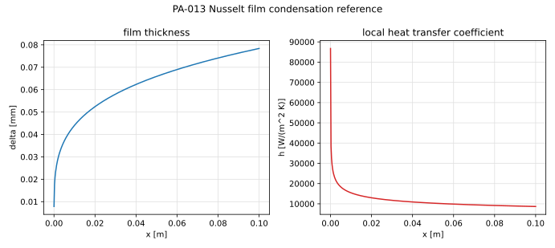

# PA-013 - Nusselt laminar film condensation

## Purpose

This benchmark verifies condensation with hydrodynamic coupling: latent heat
released at the interface is conducted across a gravity-driven liquid film
whose thickness is itself set by the accumulated condensate. It is the only
classical closed-form condensation solution and complements the
boiling-oriented cases (PA-005, PA-006): the phase change removes vapor
instead of producing it, and the interface is steady in time but developing
in space.

## Physical Configuration

Saturated quiescent vapor at $T_{sat}$ condenses on a vertical isothermal
plate of height $L_p$ held at $T_w < T_{sat}$. A laminar condensate film
flows down the plate under gravity; the film is thin, inertia and convection
in the film are negligible, the temperature profile across the film is
linear, and the vapor exerts no shear on the interface.

## Governing Equations

In the film, $0 < y < \delta(x)$ with $x$ measured downward from the leading
edge:

$$
\mu_l\,\partial_{yy} u + g\,(\rho_l - \rho_v) = 0,
\qquad
\partial_{yy} T = 0,
$$

with no slip at the wall, zero interfacial shear
$\partial_y u|_{\delta} = 0$, $T(0)=T_w$, $T(\delta)=T_{sat}$. The interface
energy balance converts the conducted heat into condensate:

$$
h_{fg}\,\frac{d\Gamma}{dx}
=
\frac{k_l\,(T_{sat}-T_w)}{\delta(x)},
\qquad
\Gamma(x) = \int_0^{\delta} \rho_l\,u\,dy
= \frac{g\,\rho_l(\rho_l-\rho_v)\,\delta^3}{3\mu_l}.
$$

## Reference Solution

The Nusselt solution is

$$
\delta(x)
=
\left[
\frac{4\,k_l\,\mu_l\,(T_{sat}-T_w)\,x}
     {g\,\rho_l\,(\rho_l-\rho_v)\,h_{fg}}
\right]^{1/4},
$$

$$
h(x) = \frac{k_l}{\delta(x)},
\qquad
\overline{h} = \frac{4}{3}\,h(L_p),
\qquad
\overline{Nu}_{L}
=
0.943
\left[
\frac{\rho_l\,g\,(\rho_l-\rho_v)\,h_{fg}\,L_p^3}
     {\mu_l\,k_l\,(T_{sat}-T_w)}
\right]^{1/4},
$$

with film velocity profile
$u(x,y) = \dfrac{g(\rho_l-\rho_v)}{\mu_l}\left(\delta y - y^2/2\right)$ and
film Reynolds number $Re_\delta = 4\Gamma/\mu_l$ (laminar, wave-free below
$Re_\delta \approx 30$). Sensible-heat corrections
($h_{fg}' = h_{fg} + 0.68\,c_{p,l}\Delta T$, Rohsenow) shift the result by
under 2% here and are not applied to the reference.

## Material Parameters

Saturated steam at atmospheric pressure on a subcooled plate.

| Parameter | Symbol | Value | Unit |
|---|---:|---:|---|
| plate height | $L_p$ | 0.1 | m |
| saturation temperature | $T_{sat}$ | 373.15 | K |
| wall temperature | $T_w$ | 363.15 | K |
| liquid density | $\rho_l$ | 958.4 | kg/m^3 |
| vapor density | $\rho_v$ | 0.60 | kg/m^3 |
| liquid viscosity | $\mu_l$ | $2.82\times10^{-4}$ | Pa s |
| liquid conductivity | $k_l$ | 0.68 | W/(m K) |
| liquid heat capacity | $c_{p,l}$ | 4216 | J/(kg K) |
| latent heat | $h_{fg}$ | $2.257\times10^{6}$ | J/kg |
| gravity | $g$ | 9.81 | m/s^2 |

## Reference Data

The file `data/PA-013/reference.csv` tabulates $\delta(x)$, $h(x)$, local
$Nu_x$, condensate mass flow $\Gamma(x)$, and $Re_\delta(x)$ along the plate,
plus the mean quantities at $x = L_p$.



## Reference Assets

Generate the CSV and figure with:

```bash
python3 scripts/plot_reference_figures.py PA-013
```

## Recommended Numerical Setup

Use a 2D rectangular domain containing the plate as the left boundary
($T=T_w$, no slip), saturated vapor at rest elsewhere, and an outflow at the
bottom. Either start from a thin uniform seed film and run to steady state,
or prescribe the Nusselt inlet film at a small $x_0 > 0$. The film is
$O(10^{-4}\,\mathrm{m})$ thick: cluster at least 8-10 cells across
$\delta(L_p)$ near the wall.

## Quantities To Report

- steady film thickness $\delta(x)$ against the $x^{1/4}$ law,
- local and mean Nusselt numbers,
- condensate mass flow at the outlet vs. integrated interfacial flux,
- velocity profile across the film at $x = L_p/2$.

## Known Difficulties

- extreme aspect ratio of the film versus the domain,
- spurious interfacial shear from the vapor side thickening the film,
- the leading-edge singularity $\delta \to 0$,
- energy balance drift if the interfacial flux is not conservatively coupled
  to the condensation rate,
- surface tension is absent from the reference: capillary smoothing of the
  film must remain negligible.

## References

@Nusselt1916
