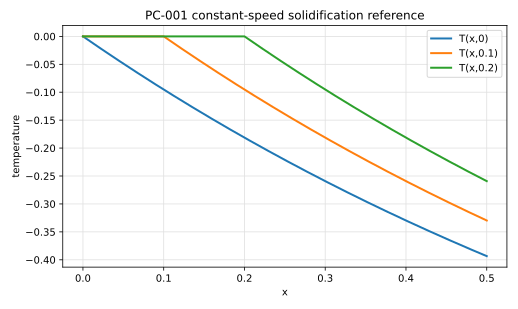

# PC-001 - Constant-speed planar solidification

## Purpose

This benchmark verifies a moving Dirichlet phase boundary with a prescribed
constant speed. It isolates interface advection and temperature reconstruction
in cells that become active as the front advances.

## Physical Configuration

A planar interface moves at prescribed speed $V$ in the positive $x$ direction.
The active phase is ahead of the interface; the region behind the front is held
at equilibrium temperature.

```text
x <= Vt                         x > Vt
solid/equilibrium region         active thermal region
T = 0                            T = -1 + exp[-V(x - Vt)]
```

## Governing Equations

The benchmark uses an imposed analytical profile, so the interface velocity is
not computed from a Stefan condition:

$$
s(t)=Vt.
$$

The temperature field is

$$
T(x,t)=
\begin{cases}
0, & x\le Vt,\\
-1+\exp[-V(x-Vt)], & x>Vt.
\end{cases}
$$

This is the exact solution used by the Basilisk test case.

## Boundary And Initial Conditions

Use the analytical temperature profile at $t=0$ and enforce the far active-side
Dirichlet value from the same expression. The Basilisk example uses $V=1$ and
periodic boundaries in the transverse direction for its two-dimensional
implementation.

## Material Parameters

Use this nondimensional reference setup.

| Parameter | Symbol | Value |
|---|---:|---:|
| interface speed | $V$ | 1 |
| equilibrium temperature | $T_{eq}$ | 0 |
| initial time shift | $t_0$ | $10^{-6}$ |
| final time | $t_{end}$ | 0.2 |

## Reference Solution

For the recommended value $V=1$,

$$
s(t)=t.
$$

The file `data/PC-001/reference.csv` tabulates $s(t)$ and $T(x,t)$ at selected
times.



## Reference Assets

Generate the CSV and figure with:

```bash
python3 scripts/plot_reference_figures.py PC-001
```

## Recommended Numerical Setup

Use a domain long enough that the active-side exponential tail is resolved over
the simulated time interval. Initialize the interface at the analytical
position corresponding to the chosen time shift.

## Quantities To Report

- interface position $s_h(t)$,
- error in $s_h(t)$,
- temperature profile at the final time,
- temperature error in newly active cells,
- convergence rate for interface position and temperature.

## Known Difficulties

- initializing the front consistently with the time shift,
- reconstructing temperature in cells uncovered by the moving interface,
- keeping the far active-side boundary consistent with the analytical profile,
- measuring interface position from a planar front without transverse noise.

## References

@ChenMerrimanOsherSmereka1997
@BasiliskAlimareDirichletExpand1D
