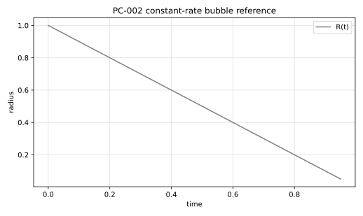

# PC-002 - Constant-rate dissolving bubble

## Purpose

This benchmark verifies interface motion and phase volume change under a
prescribed constant mass-transfer rate. It is a kinematic phase-change test:
the transported species is present in the Basilisk examples but the imposed
mass-transfer rate sets the analytical radius.

## Physical Configuration

A circular or spherical bubble dissolves at a constant interfacial mass flux.
The Basilisk sandbox provides both a planar 2D circle and an axisymmetric
sphere variant.

## Governing Equations

For a constant mass-transfer rate $\dot m$ and dispersed-phase density
$\rho_d$, the radius evolves as

$$
R(t)=R_0+\frac{\dot m}{\rho_d}t.
$$

The reference case uses a dissolving bubble, so $\dot m<0$.

## Material Parameters

Use the Gennari Basilisk setup.

| Parameter | Symbol | Value |
|---|---:|---:|
| initial radius | $R_0$ | 1 |
| continuous-phase density | $\rho_c$ | 1 |
| density ratio | $\rho_c/\rho_d$ | 1000 |
| dispersed density | $\rho_d$ | 0.001 |
| mass-transfer rate | $\dot m$ | $-10^{-3}$ |
| final time | $t_{end}$ | 1 |

## Reference Solution

For these values,

$$
R(t)=1-t.
$$

The two-dimensional area and axisymmetric volume references are

$$
A(t)=\pi R(t)^2,
\qquad
V(t)=\frac{4\pi}{3}R(t)^3.
$$

The file `data/PC-002/reference.csv` tabulates radius, area, and volume.



## Reference Assets

Generate the CSV and figure with:

```bash
python3 scripts/plot_reference_figures.py PC-002
```

## Recommended Numerical Setup

Use outflow boundaries far from the bubble so that the liquid can enter as the
bubble dissolves. For the 2D variant report area-equivalent radius; for the
axisymmetric variant report volume-equivalent radius.

## Quantities To Report

- equivalent radius $R_h(t)$,
- phase area for 2D or phase volume for axisymmetric/3D runs,
- radial symmetry error,
- final radius error.

## Known Difficulties

- comparing 2D area and axisymmetric volume with the correct reference measure,
- avoiding boundary influence as the surrounding liquid enters,
- preserving circular/spherical symmetry during strong shrinkage,
- stopping before the radius approaches zero.

## References

@Gennari2022
@BasiliskGennariConstant2D
@BasiliskGennariConstantAxi
