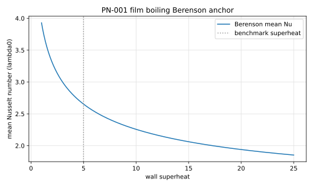

# PN-001 - Film boiling on a horizontal wall

## Purpose

This benchmark tests the full boiling problem: a saturated liquid rests on a
vapor film above a superheated wall, and the Rayleigh-Taylor-unstable
interface periodically releases bubbles while evaporation feeds the film. It
couples phase change, buoyancy, surface tension, large interface deformation,
and (for most methods) topology change, and is the standard integral test
after the one-dimensional and single-bubble cases (PA-005, PA-006) pass.

There is no exact solution. Quantitative comparison uses (i) the
space-and-time-averaged Nusselt number against the Berenson flat-plate
correlation, around which converged simulations in the literature oscillate,
and (ii) published simulation results for the same configuration
(Welch & Wilson VOF; Juric & Tryggvason and Esmaeeli & Tryggvason front
tracking; more recent LFRM and CLSVOF studies).

## Physical Configuration

A two-dimensional periodic strip of width $\lambda_d$ (the most dangerous
Taylor wavelength) contains a vapor layer on a horizontal superheated wall
below saturated liquid. The initial interface is a small single-mode
perturbation of the flat film:

$$
y_\Gamma(x)
=
\frac{\lambda_d}{128}
\left[
4 + \cos\!\left(\frac{2\pi x}{\lambda_d}\right)
\right],
\qquad
\lambda_d = 2\pi\sqrt{\frac{3\,\sigma}{g\,(\rho_l-\rho_v)}} .
$$

The wall is isothermal at $T_{sat}+\Delta T$; the liquid and interface are at
$T_{sat}$. Side boundaries are periodic; the top is an outflow far from the
film (domain height $\geq 3\lambda_d$).

## Governing Equations

Incompressible Navier-Stokes in both phases with surface tension and gravity;
energy equation with the interface held at $T_{sat}$; interfacial mass flux
from the conductive jump

$$
\dot m''
=
\frac{\big[\![\,k\,\nabla T\cdot\mathbf n\,]\!\big]}{h_{fg}},
$$

which drives the velocity jump $[\![\mathbf u\cdot\mathbf n]\!] =
\dot m''\,[\![1/\rho]\!]$ across the front.

## Material Parameters

The artificial-fluid property set widely used in the film-boiling
verification literature (moderate density ratio, thick thermal layers) is
adopted so results are directly comparable to published simulations. This
set is sometimes referred to as the "phantom fluid" and is conventionally
run at a saturation temperature of 500 K with a wall at 505 K.

| Parameter | Symbol | Value |
|---|---:|---:|
| liquid density | $\rho_l$ | 200 |
| vapor density | $\rho_v$ | 5 |
| liquid viscosity | $\mu_l$ | 0.1 |
| vapor viscosity | $\mu_v$ | 0.005 |
| liquid conductivity | $k_l$ | 40 |
| vapor conductivity | $k_v$ | 1 |
| liquid heat capacity | $c_{p,l}$ | 400 |
| vapor heat capacity | $c_{p,v}$ | 200 |
| latent heat | $h_{fg}$ | $10^{4}$ |
| surface tension | $\sigma$ | 0.1 |
| gravity | $g$ | 9.81 |
| saturation temperature | $T_{sat}$ | 500 |
| wall superheat | $\Delta T$ | 5 |

Derived scales: capillary length $\lambda_0 = \sqrt{\sigma/(g(\rho_l-\rho_v))}$,
most dangerous wavelength $\lambda_d = 2\pi\sqrt3\,\lambda_0$, vapor Jakob
number $Ja = c_{p,v}\Delta T/h_{fg} = 0.1$, vapor Prandtl number
$Pr_v = c_{p,v}\mu_v/k_v = 1$.

## Reference Solution

The wall Nusselt number, space-averaged over the strip and based on
$\lambda_0$,

$$
Nu(t)
=
\frac{\lambda_0}{\lambda_d\,\Delta T}
\int_0^{\lambda_d}
\left.\frac{\partial T}{\partial y}\right|_{wall} dx ,
$$

oscillates with the bubble release cycle around a quasi-periodic mean.
The Berenson correlation predicts

$$
\overline{Nu}_{Ber}
=
0.425
\left[
\frac{\rho_v\,(\rho_l-\rho_v)\,g\,h_{fg}'\,\lambda_0^{3}}
     {k_v\,\mu_v\,\Delta T}
\right]^{1/4},
\qquad
h_{fg}' = h_{fg} + 0.5\,c_{p,v}\,\Delta T ,
$$

and published grid-converged simulations of this configuration report
time-averaged Nusselt numbers within roughly 10-20% of it. The file
`data/PN-001/reference.csv` records the derived scales and the Berenson
values for the parameter set above. Results should additionally be compared
qualitatively (bubble pinch-off morphology, release period) to the cited
simulation studies.



## Reference Assets

Generate the CSV and figure with:

```bash
python3 scripts/plot_reference_figures.py PN-001
```

## Recommended Numerical Setup

Domain $[0,\lambda_d]\times[0,3\lambda_d]$, periodic laterally, no-slip
isothermal superheated wall at the bottom, open top held at $T_{sat}$.
Initialize the perturbed film with a linear vapor temperature profile and
saturated liquid. At least 100-128 cells per $\lambda_d$ are needed for a
release-period-converged Nusselt history; run through several bubble cycles
before averaging.

## Quantities To Report

- $Nu(t)$ history and its quasi-periodic time average,
- comparison of the mean against Berenson and against published simulations,
- bubble release period and interface snapshots over one cycle,
- vapor volume history and global mass/energy balances.

## Known Difficulties

- results depend on whether and how bubble pinch-off (topology change) is
  handled; sharp front-tracking methods without topology change reach only
  the first release,
- thin-film resolution under the rising bubble controls the Nusselt minimum,
- averaged Nusselt converges slowly in time; too-short averaging windows
  dominate the reported spread in the literature,
- the initial condition sets the phase of the cycle; compare averages, not
  instantaneous histories.

## References

@WelchWilson2000
@JuricTryggvason1998
@EsmaeeliTryggvason2004
@Berenson1961
@Rajkotwala2019
@BoydLing2023
